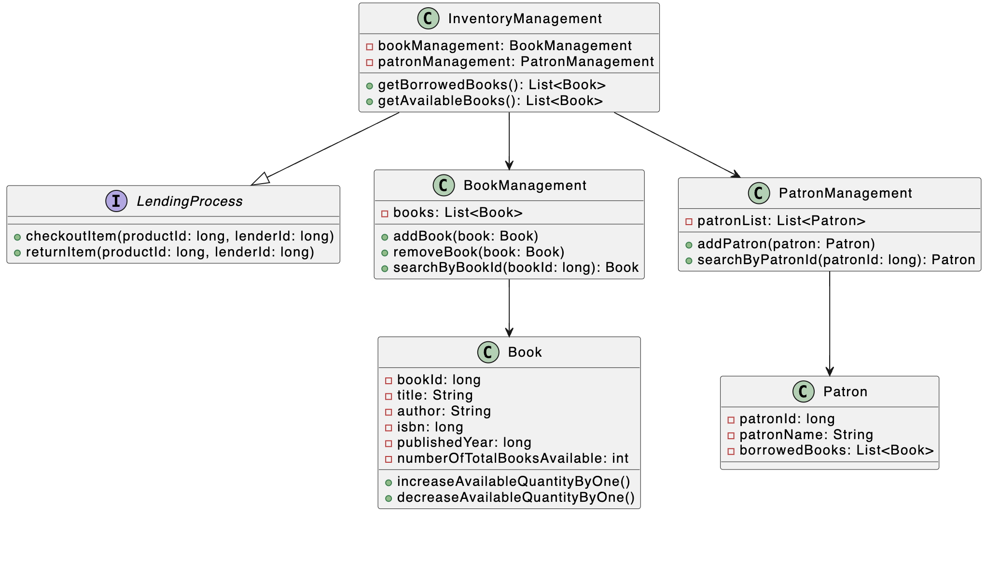

# Library Management System

## Overview

The **Library Management System** provides core features for managing books, patrons, and lending operations. It is built using **Java** and follows 
**Object-Oriented Programming (OOP)** principles. The system is designed to manage book inventory, track borrowing and returning of books, and maintain patron 
information. 

This document describes the key features and architecture of the system, with a focus on its modular design, as illustrated by the UML diagram provided.

## Features

### 1. **Lending Process (Interface)**

The system follows the **LendingProcess** interface to define two primary actions:
- `checkoutItem(productId: long, lenderId: long)` – Checks out a book for a patron.
- `returnItem(productId: long, lenderId: long)` – Returns a book to the library's available inventory.

The **LendingProcess** interface is implemented by the `InventoryManagement` class, which handles the core lending and returning functionality.

### 2. **Inventory Management**

**InventoryManagement** implements the `LendingProcess` interface and handles:
- Managing the book inventory.
- Keeping track of patrons and the books they borrow.
- Retrieving a list of available books and borrowed books.

This class is responsible for interacting with:
- **BookManagement** – To manage book-related operations (like searching, adding, or removing books).
- **PatronManagement** – To retrieve and update patron information.

#### Key Methods:
- `checkoutItem(productId: long, lenderId: long)` – Processes a book checkout for a patron.
- `returnItem(productId: long, lenderId: long)` – Processes a book return.
- `getBorrowedBooks()` – Returns a list of books currently borrowed by all patrons.
- `getAvailableBooks()` – Returns a list of available books in the inventory.

### 3. **Book Management**

The **BookManagement** class handles the library’s collection of books:
- Allows adding, removing, and searching for books.
- Keeps track of each book's availability and details.

#### Key Methods:
- `addBook(Book book)` – Adds a new book to the inventory.
- `removeBook(Book book)` – Removes an existing book from the inventory.
- `searchByBookId(long bookId)` – Finds a book by its unique ID.
  
### 4. **Book**

The **Book** class represents a library book. Each book has:
- A unique `bookId` to identify it.
- Details like `title`, `author`, `isbn`, and `publishedYear`.
- The total number of copies available.

#### Key Methods:
- `increaseAvailableQuantityByOne()` – Increases the available quantity by 1 when a book is returned.
- `decreaseAvailableQuantityByOne()` – Decreases the available quantity by 1 when a book is checked out.

### 5. **Patron Management**

The **PatronManagement** class is responsible for:
- Managing the list of patrons.
- Allowing the system to add, remove, and search for patrons by their unique ID.

#### Key Methods:
- `addPatron(Patron patron)` – Adds a new patron to the system.
- `searchByPatronId(long patronId)` – Finds a patron by their unique ID.

### 6. **Patron**

The **Patron** class represents a library user (patron). Each patron has:
- A unique `patronId` and a `patronName`.
- A list of borrowed books.

#### Key Methods:
- `getBorrowedBooks()` – Retrieves the list of books currently borrowed by the patron.

## Class Diagram

The following UML diagram illustrates the relationships between the core classes and interfaces in the system:

- **InventoryManagement** implements the **LendingProcess** interface and depends on **BookManagement** and **PatronManagement**.
- **BookManagement** manages the list of **Book** objects.
- **PatronManagement** manages the list of **Patron** objects.
- **Patron** objects can borrow **Book** objects, creating a dependency.
